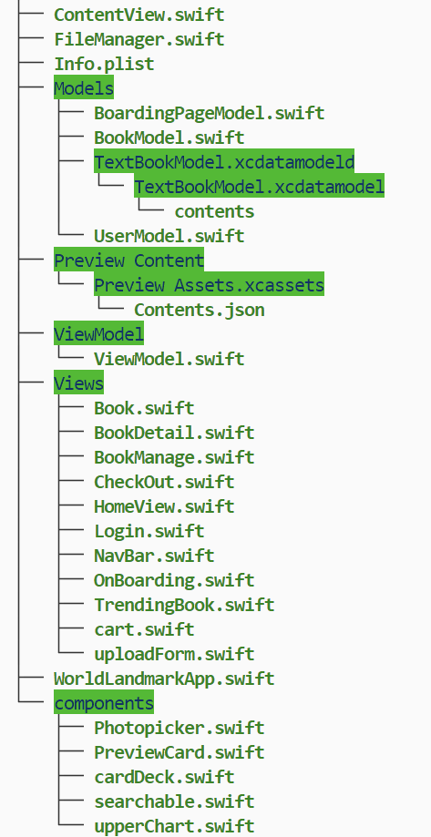
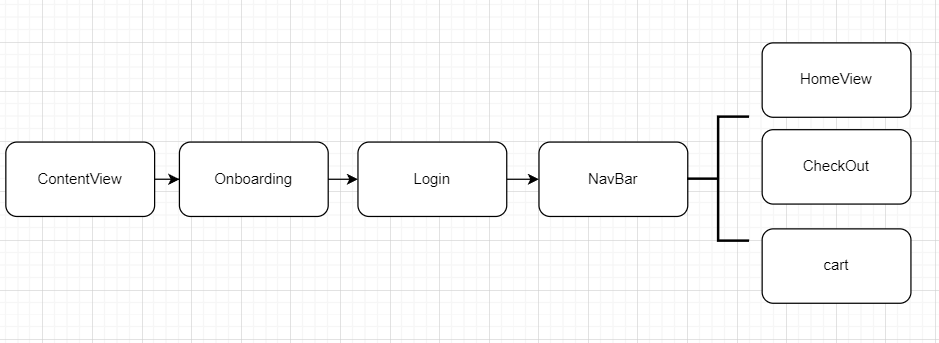
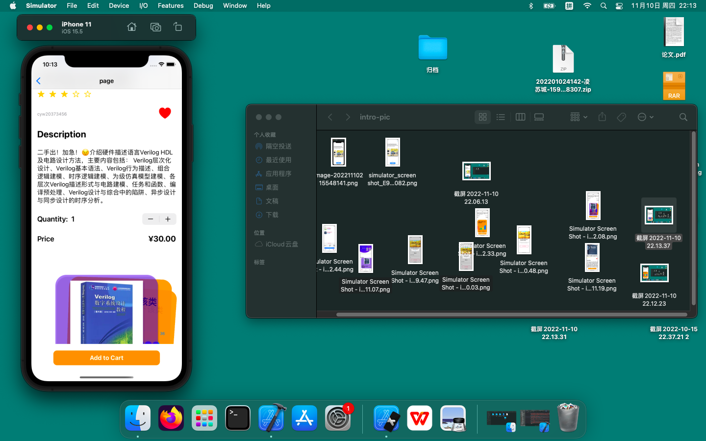
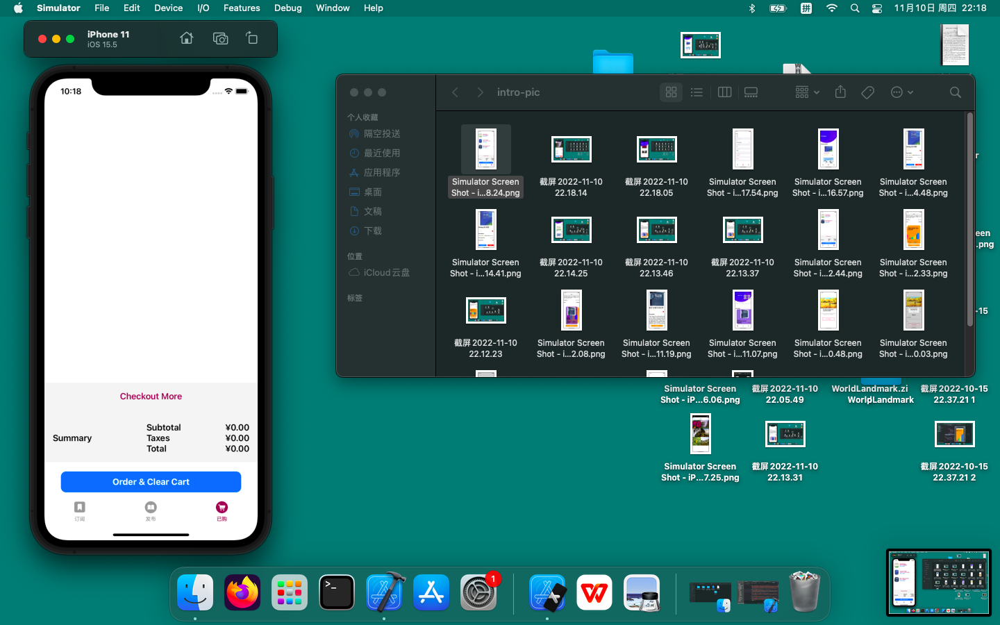

# TexBookSub Beihang University Textbook Subscription App


[TOC]

## preview

|  |  |  |
| ------------------------------------------------------------ | ------------------------------------------------------------ | ------------------------------------------------------------ |
|  |  |  |
|  |  |  |


## description

Every semester, textbook ordering becomes a tedious task that every student has to put effort into. Either each small group collects and summarizes the book purchasing information, which is then submitted by the group leader to the textbook office for ordering and distribution at the class level. Or students purchase recommended textbooks only to find out they are not needed for the entire semester. Alternatively, students try to contact senior students to buy second-hand books but often struggle to find available sellers or miss out on information shared in large group chats. It is evident that purchasing textbooks at the beginning of the semester is a highly cumbersome and scattered process. This inspires us to establish a non-profit platform within the university to centralize the channels for purchasing textbooks from the textbook office and buying/selling second-hand textbooks among students, all done online.

By doing so, it would be convenient for the textbook office as they no longer have to coordinate with each small group, and it would be easier for the small group representatives who would no longer need to handle textbook ordering, collecting payments, and book distribution. On the other hand, it would also eliminate the inconvenience caused by information asymmetry for students buying and selling textbooks.

## arch




This project adopts the "SwiftUI + MVVM" (pseudo) pattern. In the "Model" layer, two entities, "user" and "book", are established. In the "ViewModel" layer, to save effort, the ViewModel for each view is integrated into a single class. This class is accessed and shared through a singleton pattern in each "View" page. The ViewModel is marked with @MainActor to ensure that when a @Published variable changes, all the pages are updated accordingly.

```swift
@MainActor class ViewModel : ObservableObject{

    static let vm = ViewModel()
    @Published var publishedPool:[BookModel]
    @Published var userPool: [UserModel]
    @Published var nowUser: UserModel?
    @Published var displayMode: SearchTypes = SearchTypes.all
    @Published var searchKey: String = ""
```

Some components are written in the `component` section, and they use `@State` and `@Binding` for value binding. However, due to the singleton pattern of the ViewModel, it may cause slow page refreshing and needs further improvement. Additionally, if persistence is required, this approach can be used for reading and writing JSON. However, due to time constraints, I haven't implemented `Codable` for `User` and `Book` yet. There is room for further improvement.

```swift
    
   func savePublishPool() {
       do {
           let data1 = try JSONEncoder().encode(publishedPool)
           try data1.write(to: savePublishedPoolPath, options: [.atomic, .completeFileProtection])
       } catch {
           print("Unable to save data.")
       }
   }

   func saveUser() {
       do {
           let data1 = try JSONEncoder().encode(userPool)
           try data1.write(to: saveUserPoolPath, options: [.atomic, .completeFileProtection])
           let data2 = try JSONEncoder().encode(nowUser)
           try data2.write(to: saveNowUserPath, options: [.atomic, .completeFileProtection])
       } catch {
           print("Unable to save data.")
       }
   }

```


In the View layer, the structure is as follows:



## function design


1. Login and Registration
In the ViewModel, the current user is recorded as nowUser, and the UserPool keeps track of registered users. The logic for login and registration is as follows:

```swift
    func makeregister(username: String, password: String) -> Bool{
        if (userPool.contains(where: {$0.username == username})) {
            return false
        } else {
            userPool.append(UserModel(username: username, password: password, cart: [:], published: []))
//            saveUser()
            return true
        }
    }
    
    func login(username: String, password: String) -> (Bool, String){
        if let user = userPool.first(where: {$0.username == username}) {
           // do something with foo
            if user.password == password {
                nowUser = user
                return (true, "Login Succeeded")
            } else {
                return (false, "Password mismatched")
            }
        } else {
           // item could not be found
            return (false, "Username Not Found \nPlease Register First")
        }
    }
```


|      |  |      |
| ---- | ------------------------------------------------------------ | ---- |


2. Publishing and Managing Textbooks

The code for publishing and managing textbooks is located in `CheckOut.swift` within the `PublishView`. This functionality allows users to upload and publish new textbooks. In the view, we can create a new `Book` object using the parameters obtained from the bindings and then call the corresponding method in the ViewModel.

The ViewModel implementation for this functionality would include:

```swift
    func publishBookToPool(Bk:BookModel) {
        publishedPool.append(Bk)
//        savePublishPool() 如需持久化则加入这个
    }
```


book management


```swift
    func deletePublish(Bk:BookModel) {
        publishedPool = publishedPool.filter { $0 !== Bk }
//        savePublishPool()
    }
//计算属性获取当前用户的发布
var nowUserPublish: [BookModel] {
        get {
            return publishedPool.filter{$0.publisher == nowUser?.username}
        }
    }
```


3. Purchasing Textbooks

Each User maintains a `Cart` as a dictionary of `[Book: Int]` to keep track of the currently purchased items and their quantities.


```swift
    func buyBook(bk: BookModel, amount: Int) {
        print("buy book", bk, amount)
        nowUser?.addCart(bk: bk, num: amount)
//        saveUser()
    }

    func addCart(bk: BookModel, num: Int) {
        if cart[bk] != nil {
            cart[bk]! += num
            print(cart)
        } else {
            cart[bk] = num
            print(cart)
        }
    }
```

Effect:


Initial shopping cart.


Buying two books of Verilog.


Shopping cart after purchase.


Additionally, the information on our shopping homepage is obtained through computed properties.

```swift
var trending: [BookModel] {
        get {
            return publishedPool.filter{
                $0.recommend
            }
        }
    }
    

    @Published var searchRes: [BookModel]
    func getSearchRes() {
            switch displayMode {
            case .course:
                searchRes = publishedPool.filter({ $0.courses.hasPrefix(searchKey)})
            case .college:
                searchRes = publishedPool.filter({ $0.college.hasPrefix(searchKey)})
            case .bookName:
                searchRes = publishedPool.filter({ $0.title.hasPrefix(searchKey)})
            case .publisher:
                searchRes =  publishedPool.filter({ $0.publisher.hasPrefix(searchKey)})
            case .all:
                searchRes = publishedPool
            }
        
    }
```


4. clear shopping cart


