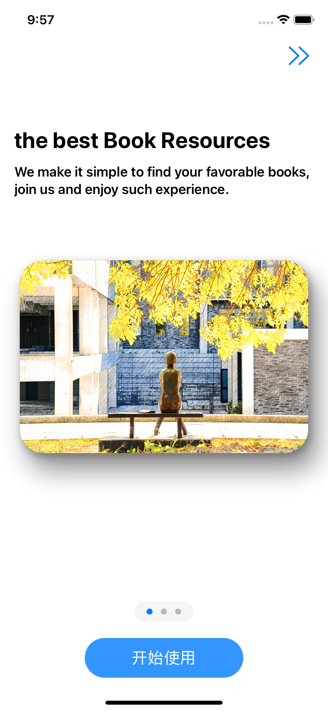

# TexBookSub 北航图书订阅app


[TOC]

## 效果预览

|  |  |  |
| ------------------------------------------------------------ | ------------------------------------------------------------ | ------------------------------------------------------------ |
|  |  |  |
|  |  |  |


## 简介

每到开学时分，课本订购就每到开学时分，课本订购就会成为每⼀位同学不得不耗费精⼒的⼀件琐事。或每个⼩班群内统计汇总购书情况，由⼩班长统⼀汇总提交⾄教材处、再以班级为单位去教材处领书、分发；或班级推荐的教材购买以后发现整个学期的课根本⽤不上此教 材；或同学们联系学长学姐购买⼆⼿书，经常因为找不到学长学姐出书、错过在⼤班群中的⼆⼿书信息⽽焦头烂额。可见，开学购买教材是⼀件极其繁琐、分散的事情。这启发我们， 能否建⽴⼀个校内的⾮营利平台，将教材处购买教材、向同学购买⼆⼿教材等教材购置渠道进⾏统⼀，在全程在线上进⾏。

这样⼀来，⼀⽅⾯⽅便教材处不⽤和各个⼩班对接，⽅便⼩班负责⼈不必处理教材订购、群收款、领书等琐事；另⼀⽅⾯也使得购买教材和出售⼆⼿教材的同学不需要再忍受信息不对等带来的不便。会成为每⼀位同学不得不耗费精⼒的⼀件琐事。或每个⼩班群内统计汇总购 书情况，由⼩班长统⼀汇总提交⾄教材处、再以班级为单位去教材处领书、分发；或班级推荐的教材购买以后发现整个学期的课根本⽤不上此教材；或同学们联系学长学姐购买⼆⼿书，经常因为找不到学长学姐出书、错过在⼤班群中的⼆⼿书信息⽽焦头烂额。可见，开学购买教材是⼀件极其繁琐、分散的事情。这启发我们，能否建⽴⼀个校内的⾮营利平台，将教材处购买教材、向同学购买⼆⼿教材等教材购置渠道进⾏统⼀，在全程在线上进⾏。

这样⼀来，⼀⽅⾯⽅便教材处不⽤和各个⼩班对接，⽅便⼩班负责⼈不必处理教材订购、群收款、领书等琐事；另⼀⽅⾯也使得购买教材和出售⼆⼿教材的同学不需要再忍受信息不对等带来的不便。

## 架构


本项目采用了`swiftUI + mvvm`模式（伪），其中在`Model`中建立了两个实体`user、book`, 在`ViewModel`中，为了节省力气，把每个视图的`ViewModel`集成在了一个类里，并通过单例模式, 在每个页面`View`中获取并共享， 其中将`ViewModel`设置位`@MainActor`使得当`@published`变量变化时，更新各个页面。

```swift
@MainActor class ViewModel : ObservableObject{

    static let vm = ViewModel()
    @Published var publishedPool:[BookModel]
    @Published var userPool: [UserModel]
    @Published var nowUser: UserModel?
    @Published var displayMode: SearchTypes = SearchTypes.all
    @Published var searchKey: String = ""
```

其中部分组件写在了`component`中， 会采用`@State` `@Binding`绑定传值。但由于单例模式下的viewmodel 会一定可能导致页面刷新过慢，还需要进一步完善。另外，如需持久化，则可以采取该方式进行对json的读写，但由于时间原因，我没由实现`User、Book`的`Codable`, 还可以进一步改进

```swift
    
   func savePublishPool() {
       do {
           let data1 = try JSONEncoder().encode(publishedPool)
           try data1.write(to: savePublishedPoolPath, options: [.atomic, .completeFileProtection])
       } catch {
           print("Unable to save data.")
       }
   }

   func saveUser() {
       do {
           let data1 = try JSONEncoder().encode(userPool)
           try data1.write(to: saveUserPoolPath, options: [.atomic, .completeFileProtection])
           let data2 = try JSONEncoder().encode(nowUser)
           try data2.write(to: saveNowUserPath, options: [.atomic, .completeFileProtection])
       } catch {
           print("Unable to save data.")
       }
   }

```


View视图中，其结构为


## 功能设计与实现

1. 登录注册

在viewModel中记录了当前用户nowUser，UserPool中记录了已经注册的用户，登陆注册的逻辑如下

```swift
    func makeregister(username: String, password: String) -> Bool{
        if (userPool.contains(where: {$0.username == username})) {
            return false
        } else {
            userPool.append(UserModel(username: username, password: password, cart: [:], published: []))
//            saveUser()
            return true
        }
    }
    
    func login(username: String, password: String) -> (Bool, String){
        if let user = userPool.first(where: {$0.username == username}) {
           // do something with foo
            if user.password == password {
                nowUser = user
                return (true, "Login Succeeded")
            } else {
                return (false, "Password mismatched")
            }
        } else {
           // item could not be found
            return (false, "Username Not Found \nPlease Register First")
        }
    }
```

效果（正确为 cyw20373456, 123123）

|      |  |      |
| ---- | ------------------------------------------------------------ | ---- |


2. 发布、管理教材

其代码位于`CheckOut.swift` 中的`PublishView`中，可以支持用户的上传发布新的教材，我们在view中对绑定得到参数进行新建Book对象然后调用ViewModel中的方法即可，ViewModel中的实现为

```swift
    func publishBookToPool(Bk:BookModel) {
        publishedPool.append(Bk)
//        savePublishPool() 如需持久化则加入这个
    }
```

效果为


此外还可以对书籍进行管理


```swift
    func deletePublish(Bk:BookModel) {
        publishedPool = publishedPool.filter { $0 !== Bk }
//        savePublishPool()
    }
//计算属性获取当前用户的发布
var nowUserPublish: [BookModel] {
        get {
            return publishedPool.filter{$0.publisher == nowUser?.username}
        }
    }
```

3. 购买教材

每个User都维护了一个Cart:[Book:Int] 的列表用于记录当前购买的商品和数量

```swift
    func buyBook(bk: BookModel, amount: Int) {
        print("buy book", bk, amount)
        nowUser?.addCart(bk: bk, num: amount)
//        saveUser()
    }

    func addCart(bk: BookModel, num: Int) {
        if cart[bk] != nil {
            cart[bk]! += num
            print(cart)
        } else {
            cart[bk] = num
            print(cart)
        }
    }
```

效果：


最初的购物车


买两本verilog


买完以后


此外我们购物主页的信息，通过计算属性来获取

```swift
var trending: [BookModel] {
        get {
            return publishedPool.filter{
                $0.recommend
            }
        }
    }
    

    @Published var searchRes: [BookModel]
    func getSearchRes() {
            switch displayMode {
            case .course:
                searchRes = publishedPool.filter({ $0.courses.hasPrefix(searchKey)})
            case .college:
                searchRes = publishedPool.filter({ $0.college.hasPrefix(searchKey)})
            case .bookName:
                searchRes = publishedPool.filter({ $0.title.hasPrefix(searchKey)})
            case .publisher:
                searchRes =  publishedPool.filter({ $0.publisher.hasPrefix(searchKey)})
            case .all:
                searchRes = publishedPool
            }
        
    }
```


4. 清空购物车


